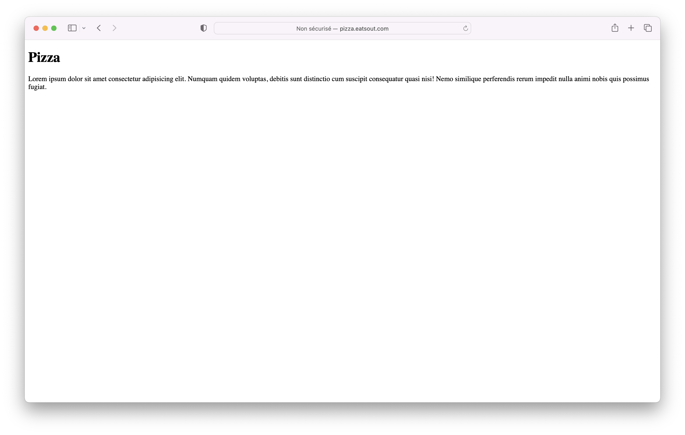
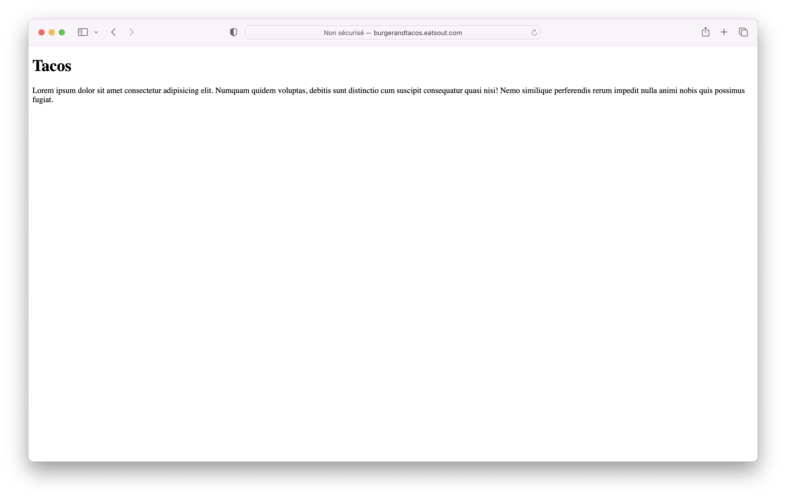
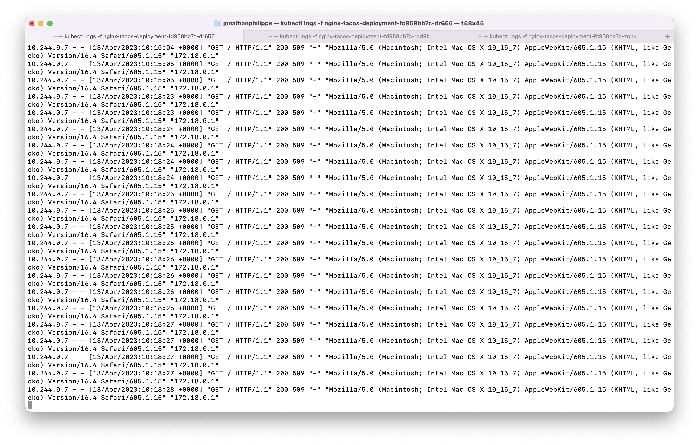

# TP Ingress

```zsh
kind create cluster --name my-cluster --config kind_config.yaml
```

```zsh
kubectl apply -f https://raw.githubusercontent.com/kubernetes/ingress-nginx/main/deploy/static/provider/kind/deploy.yaml
````

```zsh
kubectl wait --namespace ingress-nginx \
  --for=condition=ready pod \
  --selector=app.kubernetes.io/component=controller \
  --timeout=90s
```

## Voir le schéma dans le [fichier pdf](./TP%20Kubernetes%20Ingress.pdf)

Pour chaque dossier (Burger, Pizza et Tacos)
```zsh 
cd Burger/
docker build -t burger -f Dockerfile .
docker tag burger philippe1jonathan/restaurants:burger
docker push philippe1jonathan/restaurants:burger 
kubectl apply -f conf.yaml
```
Pour dépoyer l'ingress
```zsh
kubectl apply -f ingress_restaurants.yaml
```

Voir le fichier [ingress.yaml](./ingress.yaml) et les fichiers "conf.yaml" dans chaque dossier :
Burger : [conf.yaml](./Burger/conf.yaml) / Pizza : [conf.yaml](./Pizza/conf.yaml) / Tacos : [conf.yaml](./Tacos/conf.yaml)

Ajouter cette ligne dans le fichier "/etc/hosts"
```zsh
127.0.0.1 pizza.eatsout.com burgerandtacos.eatsout.com
```

pizza.eatsout.com


burgerandtacos.eatsout.com/burgers


burgerandtacos.eatsout.com/tacos


Pour gerer 3 fois plus de commande sur le magasin des Tacos j'ai modifier la valeur de l'attribut "replicas" passant de 1 à 3 dans le fichier [Tacos/conf.yaml](./Tacos/conf.yaml)

Comment verifier que la charge soit bien répartie ?
Avec la commande `kubectl logs -f <nom-du-pod>`, l'option "-f" permet d'avoir le flux des logs en continu.
J'ai ouvert 3 onglets dans mon terminal et j'execute cette commande pour chaque pod qui correspond à Tacos.


# ArgoCD
## Install on cluster : 
```zsh
kubectl create namespace argocd
```
```zsh
kubectl apply -n argocd -f https://raw.githubusercontent.com/argoproj/argo-cd/stable/manifests/core-install.yaml
```
## Access The Argo CD API Server :
```zsh
kubectl port-forward svc/argocd-server -n argocd 8080:443
```
## Login :
```
Username : admin
```
For get password : 
```zsh
argocd admin initial-password -n argocd
```

## Create app
Go to settings -> repository and connect your repository.

Click on "Create app" and adjust informations.

```
App name : eatsout
Url git : "`url of repository`.git"
Path : "./"
```